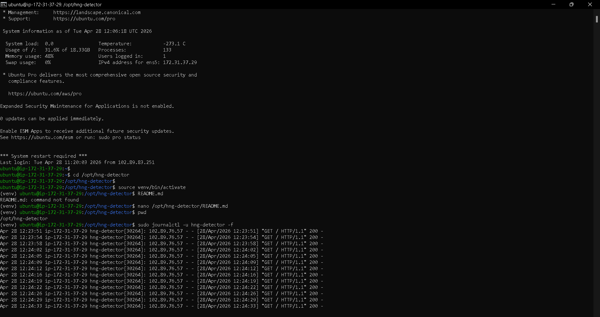
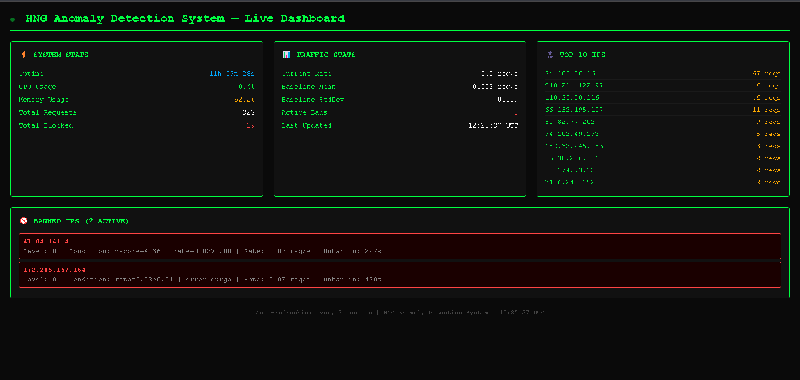
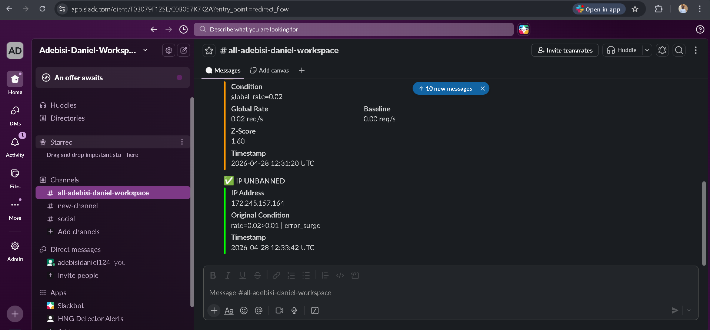
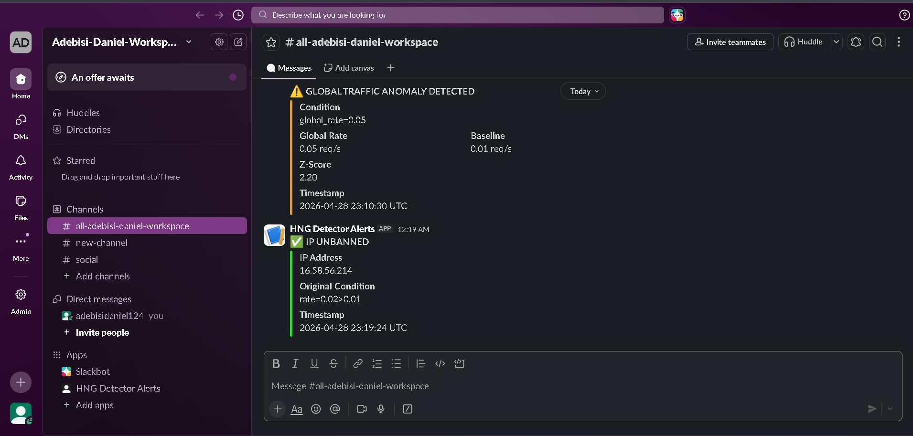
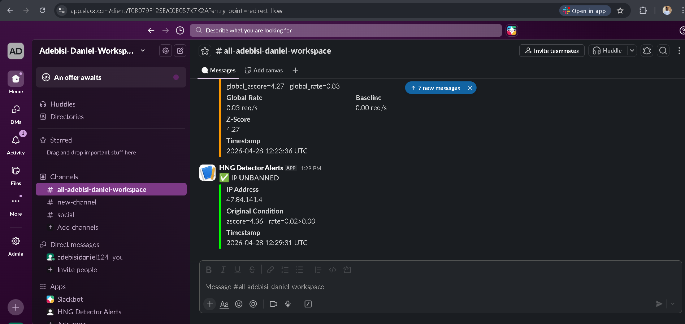
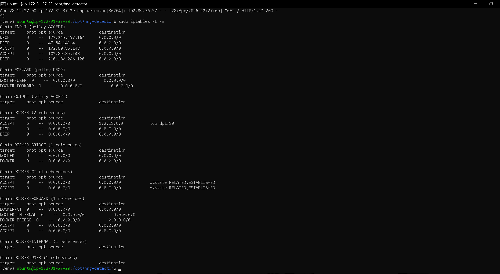
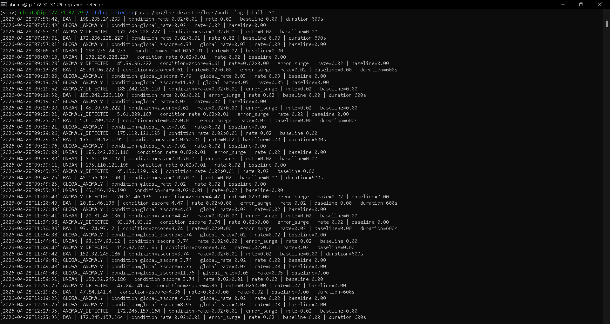

# HNG Stage 3: Real-Time Anomaly Detection Engine for DDoS Prevention

A production-ready anomaly detection system that monitors HTTP traffic in real-time, learns normal behavior patterns, and automatically blocks malicious IPs using statistical analysis and iptables rules.

## 🌐 Live Deployment

- **Server IP:** `3.90.230.120`
- **Dashboard URL:** [http://3.90.230.120:5000](http://3.90.230.120:5000)
- **Status:** Running 24/7 for attack detection
- **GitHub Repository:** [https://github.com/AdebisiOluwatimileyin/hng-stage3-detector](https://github.com/AdebisiOluwatimileyin/hng-stage3-detector)

## 📖 Table of Contents

- [Overview](#overview)
- [Why Python?](#why-python)
- [Architecture](#architecture)
- [How It Works](#how-it-works)
  - [Sliding Window Mechanism](#sliding-window-mechanism)
  - [Baseline Calculation](#baseline-calculation)
  - [Anomaly Detection Logic](#anomaly-detection-logic)
  - [Blocking with iptables](#blocking-with-iptables)
- [Installation](#installation)
- [Configuration](#configuration)
- [Screenshots](#screenshots)
- [Blog Post](#blog-post)

---

## 🎯 Overview

This project implements a **real-time anomaly detection daemon** that:

1. **Monitors** Nginx access logs continuously (tail-like behavior)
2. **Tracks** request rates using sliding windows (last 60 seconds)
3. **Learns** what "normal" traffic looks like using a rolling 30-minute baseline
4. **Detects** anomalies using z-score analysis (statistical deviation)
5. **Blocks** malicious IPs automatically with iptables
6. **Alerts** via Slack in real-time
7. **Unbans** IPs on a progressive backoff schedule
8. **Displays** live metrics via a web dashboard

### Use Case

This tool protects a Nextcloud deployment from:
- DDoS attacks (distributed denial of service)
- Single-IP flooding
- Error-based attacks (4xx/5xx surges)
- Traffic spikes that deviate from learned patterns

---

## 🐍 Why Python?

I chose **Python** for this project because:

### 1. **Rich Standard Library**
- `collections.deque` — Perfect for implementing sliding windows with O(1) operations
- `statistics` module — Built-in mean and standard deviation calculations
- `threading` — Easy multi-threaded daemon architecture
- `subprocess` — Clean iptables command execution

### 2. **Readability**
As a beginner-friendly project, Python's clear syntax makes the complex logic easier to understand and maintain.

### 3. **Rapid Development**
Python allowed me to implement, test, and debug all components quickly without fighting the language.

### 4. **Production-Ready Libraries**
- Flask for the dashboard
- Requests for Slack webhooks
- psutil for system metrics

### Alternative: Go
Go would have been faster in execution, but Python's development speed and clarity made it the right choice for a learning-focused project with a tight deadline.

---

## 🏗️ Architecture
┌─────────────────────────────────────────────────────────────┐
│                     DOCKER STACK                             │
│  ┌──────────────┐         ┌─────────────────┐              │
│  │   Nextcloud  │ ←───────│  Nginx (Proxy)  │              │
│  │  (Port 80)   │         │  JSON Logs      │              │
│  └──────────────┘         └────────┬────────┘              │
│                                     │                        │
│                            Docker Volume:                    │
│                          HNG-nginx-logs                      │
│                                     │                        │
└─────────────────────────────────────┼────────────────────────┘
│
▼
┌─────────────────────────┐
│   DETECTOR DAEMON       │
│   (Python, systemd)     │
│                         │
│  ┌──────────────────┐   │
│  │  monitor.py      │   │ ← Tail logs
│  └────────┬─────────┘   │
│           │             │
│  ┌────────▼─────────┐   │
│  │ sliding_window   │   │ ← Track rates
│  └────────┬─────────┘   │
│           │             │
│  ┌────────▼─────────┐   │
│  │   baseline.py    │   │ ← Learn normal
│  └────────┬─────────┘   │
│           │             │
│  ┌────────▼─────────┐   │
│  │  detector.py     │   │ ← Detect anomalies
│  └────────┬─────────┘   │
│           │             │
│  ┌────────▼─────────┐   │
│  │  blocker.py      │   │ ← iptables DROP
│  └────────┬─────────┘   │
│           │             │
│  ┌────────▼─────────┐   │
│  │  unbanner.py     │   │ ← Progressive unban
│  └────────┬─────────┘   │
│           │             │
│  ┌────────▼─────────┐   │
│  │  notifier.py     │   │ ← Slack alerts
│  └──────────────────┘   │
│                         │
│  ┌──────────────────┐   │
│  │  dashboard.py    │   │ ← Web UI (Port 5000)
│  └──────────────────┘   │
└─────────────────────────┘

---

## 🔍 How It Works

### 1. Sliding Window Mechanism

The sliding window tracks request rates over the **last 60 seconds** using Python's `collections.deque`.

#### Data Structure

```python
# Per-IP windows: {ip: deque([timestamp1, timestamp2, ...])}
ip_windows = {
    "192.168.1.1": deque([
        datetime(2026, 4, 28, 10, 30, 15),
        datetime(2026, 4, 28, 10, 30, 16),
        datetime(2026, 4, 28, 10, 30, 17),
        # ... more timestamps
    ]),
    "192.168.1.2": deque([...])
}

# Global window: deque([timestamp1, timestamp2, ...])
global_window = deque([...])
```

#### How It Works

1. **Add Request**: When a log line is parsed, the timestamp is appended to:
   - The IP's deque
   - The global deque

2. **Eviction**: Before reading the count, we remove timestamps older than 60 seconds:
```python
   cutoff = current_time - timedelta(seconds=60)
   while deque and deque[0] < cutoff:
       deque.popleft()  # O(1) operation
```

3. **Calculate Rate**:
```python
   count = len(deque)
   rate = count / 60  # requests per second
```

#### Why Deques?

- **O(1) append** — Adding new timestamps is instant
- **O(1) popleft** — Removing old timestamps is instant
- **No external dependencies** — Pure Python standard library
- **Memory efficient** — Automatically maintains size

#### Example

If an IP makes 120 requests in 60 seconds:
- Deque contains 120 timestamps
- Rate = 120 / 60 = **2.0 req/s**

After 61 seconds:
- Old timestamps are evicted
- Only recent requests remain
- Rate updates dynamically

---

### 2. Baseline Calculation

The baseline represents **"normal" traffic** and is calculated from a **rolling 30-minute window** (1800 seconds).

#### Data Structure

```python
# Per-second counts: deque([(timestamp, count), ...])
per_second_counts = deque([
    (datetime(..., 10, 30, 00), 5),   # 5 requests at 10:30:00
    (datetime(..., 10, 30, 01), 3),   # 3 requests at 10:30:01
    (datetime(..., 10, 30, 02), 7),   # 7 requests at 10:30:02
    # ... up to 1800 entries (30 minutes)
], maxlen=1800)

# Per-hour tracking: {hour: [counts]}
hourly_data = {
    10: [5, 3, 7, 4, 6, ...],  # Hour 10 (10:00-10:59)
    11: [8, 5, 6, ...]         # Hour 11 (11:00-11:59)
}
```

#### Recalculation Process

Every **60 seconds**, the baseline recalculates:

```python
# Step 1: Decide which data to use
current_hour = datetime.now().hour
current_hour_counts = hourly_data.get(current_hour, [])

if len(current_hour_counts) >= 300:  # 5 minutes of data
    # Prefer current hour (more relevant)
    counts = current_hour_counts
else:
    # Use full 30-minute window
    counts = [count for _, count in per_second_counts]

# Step 2: Calculate statistics
mean = statistics.mean(counts)
stddev = statistics.stdev(counts)

# Step 3: Apply floor values (prevent edge cases)
effective_mean = max(1.0, mean)
effective_stddev = max(0.5, stddev)
```

#### Why This Approach?

- **Adaptive**: Learns from actual traffic, not hardcoded values
- **Time-aware**: Different hours have different "normal" patterns
- **Recent-focused**: Prefers current hour when enough data exists
- **Robust**: Floor values prevent false positives during quiet periods

#### Example

**Scenario**: Website has 100 req/s during work hours, 10 req/s at night

At **2:00 PM** (work hours):
- Rolling window captures recent high traffic
- Baseline mean ≈ 95 req/s
- A spike to 300 req/s triggers an alert (3x baseline)

At **2:00 AM** (quiet hours):
- Rolling window captures recent low traffic
- Baseline mean ≈ 12 req/s
- Same 300 req/s spike is an even bigger anomaly

**The baseline adapts automatically!**

---

### 3. Anomaly Detection Logic

An IP or global traffic is flagged as anomalous if **either** condition fires:

#### Condition 1: Z-Score > 3.0

The **z-score** measures how many standard deviations a value is from the mean:

```python
z_score = (current_rate - baseline_mean) / baseline_stddev
```

If `z_score > 3.0`, it's statistically unusual (99.7% confidence interval).

**Example**:
- Baseline mean = 50 req/s
- Baseline stddev = 10
- Current rate = 85 req/s
- Z-score = (85 - 50) / 10 = **3.5** ❌ **ANOMALY!**

#### Condition 2: Rate > 5x Baseline Mean

A simpler multiplier check for extreme spikes:

```python
if current_rate > (5 * baseline_mean):
    # Anomaly detected
```

**Example**:
- Baseline mean = 20 req/s
- Current rate = 105 req/s
- 105 > (5 × 20) = 105 > 100 ❌ **ANOMALY!**

#### Error Surge Detection

If an IP's error rate (4xx/5xx) is **3x the baseline error rate**, detection thresholds tighten:

```python
if error_rate > (3 * baseline_error_rate):
    # Use stricter thresholds for this IP
    z_threshold = 2.0  # Instead of 3.0
    multiplier = 3     # Instead of 5
```

This catches **scanning bots** and **brute-force attacks** early.

---

### 4. Blocking with iptables

When an anomaly is detected for a specific IP, the blocker adds an **iptables DROP rule**:

```python
import subprocess

def block_ip(ip_address):
    cmd = ["iptables", "-A", "INPUT", "-s", ip_address, "-j", "DROP"]
    subprocess.run(cmd, check=True)
```

#### What This Does

```bash
# Before block:
Chain INPUT (policy ACCEPT)
target     prot opt source               destination

# After blocking 45.156.129.190:
Chain INPUT (policy ACCEPT)
target     prot opt source               destination
DROP       all  --  45.156.129.190       0.0.0.0/0
```

The IP is **immediately dropped** at the kernel level — no application processing needed.

#### Unban Schedule (Progressive Backoff)

IPs are unbanned on an escalating schedule:

1. **First offense**: Unban after **10 minutes**
2. **Second offense**: Unban after **30 minutes**
3. **Third offense**: Unban after **2 hours**
4. **Fourth+ offense**: **Permanent ban**

```python
def unblock_ip(ip_address):
    cmd = ["iptables", "-D", "INPUT", "-s", ip_address, "-j", "DROP"]
    subprocess.run(cmd, check=True)
```

---

## 🚀 Installation

### Prerequisites

- Linux VPS (Ubuntu 24.04 recommended)
- Minimum 2 vCPU, 2 GB RAM
- Docker & Docker Compose installed
- Root/sudo access

### Step 1: Clone the Repository

```bash
git clone https://github.com/AdebisiOluwatimileyin/hng-stage3-detector.git
cd hng-stage3-detector
```

### Step 2: Deploy Nextcloud Stack

```bash
cd /opt
sudo mkdir -p hng-nextcloud hng-detector
sudo chown -R $USER:$USER /opt/hng-nextcloud /opt/hng-detector

# Create docker-compose.yml in /opt/hng-nextcloud
# (See repository for full docker-compose.yml)

cd /opt/hng-nextcloud
docker compose up -d
```

### Step 3: Verify Logs Are Flowing

```bash
docker exec hng-nginx cat /var/log/nginx/hng-access.log
```

You should see JSON-formatted log entries.

### Step 4: Set Up Detector

```bash
cd /opt/hng-detector
python3 -m venv venv
source venv/bin/activate
pip install -r requirements.txt
```

### Step 5: Configure Slack Webhook

Edit `config.py`:
```python`
import os

SLACK_WEBHOOK_URL = os.getenv("SLACK_WEBHOOK_URL")

### Step 6: Install as systemd Service

```bash
sudo cp hng-detector.service /etc/systemd/system/
sudo systemctl daemon-reload
sudo systemctl enable hng-detector
sudo systemctl start hng-detector
```

### Step 7: Verify It's Running

```bash
sudo systemctl status hng-detector
curl http://localhost:5000  # Dashboard
```

---

## ⚙️ Configuration

Edit `config.py` to customize:

```python
# Paths
LOG_FILE_PATH = "/var/lib/docker/volumes/HNG-nginx-logs/_data/hng-access.log"

# Detection thresholds
Z_SCORE_THRESHOLD = 3.0        # Standard deviations
MULTIPLIER_THRESHOLD = 5       # Times baseline mean
ERROR_SURGE_MULTIPLIER = 3     # Error rate multiplier

# Windows
SLIDING_WINDOW_SIZE = 60       # seconds
BASELINE_WINDOW_SIZE = 1800    # 30 minutes
BASELINE_RECALC_INTERVAL = 60  # 1 minute

# Unban schedule (minutes)
UNBAN_SCHEDULE = [10, 30, 120]

# Slack
import os

SLACK_WEBHOOK_URL = os.getenv("SLACK_WEBHOOK_URL")

# Dashboard
DASHBOARD_PORT = 5000
DASHBOARD_REFRESH_INTERVAL = 3  # seconds
```

---

## 📸 Screenshots

### 1. Tool Running

*Daemon processing log lines in real-time*

### 2. Dashboard

*Live metrics at http://3.90.230.120:5000*

### 3. Slack Ban Alert

*IP banned notification with z-score details*

### 4. Slack Unban Alert

*IP unbanned after timeout*

### 5. Global Anomaly Alert

*Global traffic spike detected*

### 6. iptables Rules

*Blocked IPs in iptables*

### 7. Audit Log

*Structured log with ban, unban, and baseline events*

---

## 📝 Blog Post

**Read the full beginner-friendly tutorial:**

[Building a Real-Time DDoS Detection Engine from Scratch](YOUR_BLOG_URL_HERE)

Topics covered:
- What anomaly detection is and why it matters
- How sliding windows work with Python deques
- How baselines learn from traffic patterns
- How z-scores detect statistical anomalies
- How iptables blocks malicious IPs at the kernel level

---

## 📊 Metrics Dashboard Features

- **System Stats**: Uptime, CPU, memory usage
- **Traffic Stats**: Current rate, baseline, active bans
- **Top 10 IPs**: Most active sources
- **Banned IPs**: Currently blocked with ban duration
- **Auto-refresh**: Updates every 3 seconds

---

## 🐛 Troubleshooting

### Detector Not Starting

```bash
sudo journalctl -u hng-detector -n 50
```

### Dashboard Not Accessible

```bash
# Check if port 5000 is open
sudo netstat -tlnp | grep 5000

# Check firewall rules
sudo ufw status
```

### No Logs Being Processed

```bash
# Verify log file exists
ls -la /var/lib/docker/volumes/HNG-nginx-logs/_data/

# Check Nginx container
docker logs hng-nginx
```

---

## 🤝 Contributing

This is a learning project for the HNG Internship. Feedback and suggestions are welcome!

---

## 📄 License

MIT License - Feel free to learn from and adapt this code.

---

## 🙏 Acknowledgments

- **HNG Internship** for the challenging task
- **Nextcloud** for the base Docker image
- The open-source community for Python, Flask, and Linux tools

---

**Built with ❤️ by Adebisi Daniel Oluwatimileyin**

- Email: adebisidaniel124@gmail.com
- GitHub: [@AdebisiOluwatimileyin](https://github.com/AdebisiOluwatimileyin)

---

*This project demonstrates production-ready DevSecOps skills: log monitoring, statistical analysis, automated response, and real-time alerting.*

